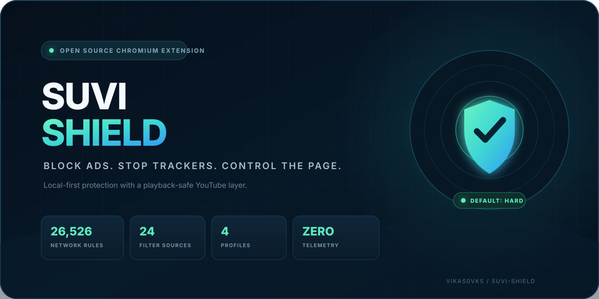
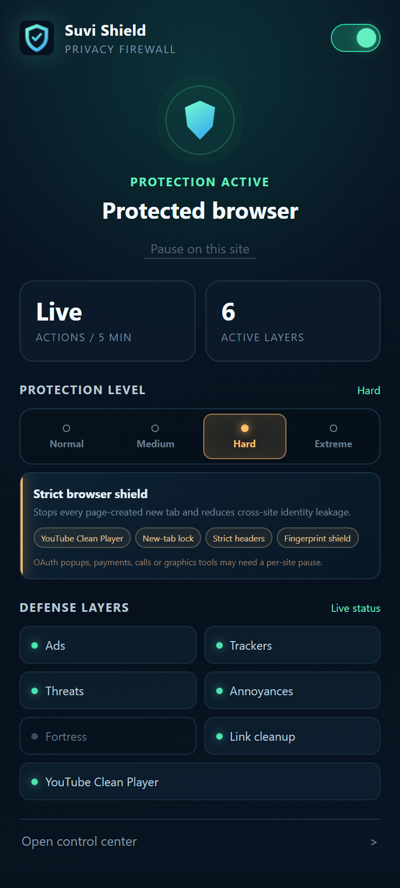
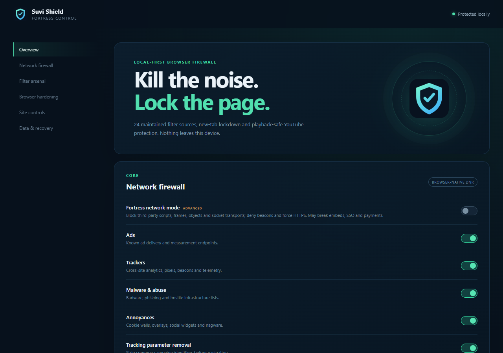

<p align="center">
  
</p>

# Suvi Shield

<p align="center">
  <a href="https://github.com/vikas0vks/suvi-shield/releases/latest"></a>
  <a href="https://github.com/vikas0vks/suvi-shield/actions/workflows/ci.yml"></a>
  
  
  
  <a href="LICENSE"></a>
</p>

<p align="center">
  <strong>Open-source ad blocking, tracker protection and browser hardening for Chrome and Chromium.</strong>
</p>

<p align="center">
  <a href="https://github.com/vikas0vks/suvi-shield/releases/latest"><strong>Download latest release</strong></a>
  &nbsp; | &nbsp;
  <a href="#install">Install</a>
  &nbsp; | &nbsp;
  <a href="#protection-profiles">Profiles</a>
  &nbsp; | &nbsp;
  <a href="PRIVACY.md">Privacy</a>
</p>

Suvi Shield is a local-first Chrome ad blocker and privacy extension built for Manifest V3. It blocks ads, trackers, malicious domains, popups, tracking links and common browser abuse without sending browsing activity to a remote service. The extension also includes playback-safe YouTube protection, per-site controls and four configurable protection profiles.

## Product preview

<table>
  <tr>
    <td width="34%" align="center" valign="top">
      
      <br>
      <sub>Default Hard profile with live defense status</sub>
    </td>
    <td width="66%" align="center" valign="top">
      
      <br>
      <sub>Local control center for network, page and site protection</sub>
    </td>
  </tr>
</table>

## At a glance

<table>
  <tr>
    <td align="center"><strong>26,526</strong><br><sub>Network rules</sub></td>
    <td align="center"><strong>24</strong><br><sub>Maintained filter sources</sub></td>
    <td align="center"><strong>4</strong><br><sub>Protection profiles</sub></td>
    <td align="center"><strong>0</strong><br><sub>Telemetry events</sub></td>
  </tr>
</table>

## Protection system

| Network protection | Page protection |
| --- | --- |
| Ads, trackers, analytics and beacons | Cosmetic ad and annoyance cleanup |
| Malicious URL and badware domains | Popup, popunder and new-tab lockdown |
| Tracking parameter removal | YouTube Clean Player |
| Strict third-party cookie and referrer controls | Link cleanup and opener hardening |
| Optional third-party active-content blocking | Canvas, WebGL and hardware normalization |
| WebRTC non-proxied UDP protection | Per-site pause and custom domain controls |

Suvi Shield has no accounts, telemetry, remote executable code or acceptable-ads program. Settings, trusted sites and custom blocks stay in local browser storage.

## Protection profiles

| Profile | Protection | Compatibility |
| --- | --- | --- |
| Normal | Ads, trackers, threats, YouTube Clean Player, cosmetic filtering and link cleanup | Highest |
| Medium | Normal plus annoyance filtering and WebRTC protection | High |
| **Hard** | Medium plus new-tab lockdown, strict headers and fingerprint protection | **Recommended default** |
| Extreme | Hard plus third-party active-content blocking and capability restrictions | Lowest |

Hard is enabled on every fresh installation. Extreme remains available for users who accept a higher chance of site breakage. Changing an individual switch creates a Custom profile without overwriting trusted sites or custom blocked domains.

## YouTube Clean Player

The dedicated YouTube layer removes known promoted surfaces and reacts only when the player reports an active ad. It can press available skip controls, mute and accelerate ad media, and restore the original playback state when the ad ends. Normal video playback is not modified when no ad state is present.

YouTube changes frequently, so permanent coverage for every ad format cannot be guaranteed. Suvi Shield avoids response-body rewriting because that approach can damage normal playback and autoplay behavior.

## Install

> [Download the current Chromium package](https://github.com/vikas0vks/suvi-shield/releases/latest)

1. Download the `suvi-shield` Chromium ZIP from the latest release.
2. Extract the ZIP file to a permanent folder.
3. Open `chrome://extensions` in Chrome or another Chromium browser.
4. Enable Developer mode.
5. Select **Load unpacked** and choose the extracted folder.

Chrome does not load an unpacked extension directly from a ZIP file. Keep the extracted folder after installation.

<details>
<summary><strong>Build from source</strong></summary>

Requirements:

- Node.js 22 or newer
- npm 10 or newer
- Google Chrome 120 or newer for browser tests

```powershell
npm install
npm run rules:update
npm run check
npm run smoke
npm run package
```

The unpacked extension is written to `dist/`. The release archive is written to `release/`.

For an offline development build, use `npm run rules:starter`. Public release builds must use the maintained filter sources and pass `npm run validate:release`.

</details>

<details>
<summary><strong>Quality gates</strong></summary>

Every release is checked with:

- ESLint and strict TypeScript validation
- Unit tests for settings, domains, messages and URL cleanup
- Manifest resource and static DNR limit validation
- Protection profile and Custom mode verification
- Popup and unwanted new-tab browser tests
- YouTube ad-state handling and playback restoration tests
- Release filter integrity and fallback detection

Optional live YouTube playback check:

```powershell
$env:SUVI_LIVE_YOUTUBE='1'
npm run smoke
```

</details>

<details>
<summary><strong>Permission reference</strong></summary>

| Permission | Purpose |
| --- | --- |
| `declarativeNetRequest` | Apply packaged network protection rules |
| `scripting` | Register protection scripts and cosmetic styles |
| `storage` | Save local settings, trusted sites and custom blocks |
| `privacy` | Apply the optional WebRTC IP handling policy |
| `activeTab` | Read the current site for popup controls |
| `alarms` | Support event-driven extension maintenance |
| All sites | Apply network, cosmetic and link protection on visited pages |

</details>

## Privacy and security

Suvi Shield processes URLs and page elements locally. It does not collect browsing history, page content, account information, telemetry or rule-match logs. Read the [privacy policy](PRIVACY.md) and [security policy](SECURITY.md) for details.

## Author

Created and maintained by [vikas0vks](https://github.com/vikas0vks).

## License

Source code is licensed under GPL-3.0-or-later. Compiled filter data keeps the licenses and attribution requirements of its original projects. See [THIRD_PARTY_NOTICES.md](THIRD_PARTY_NOTICES.md).
